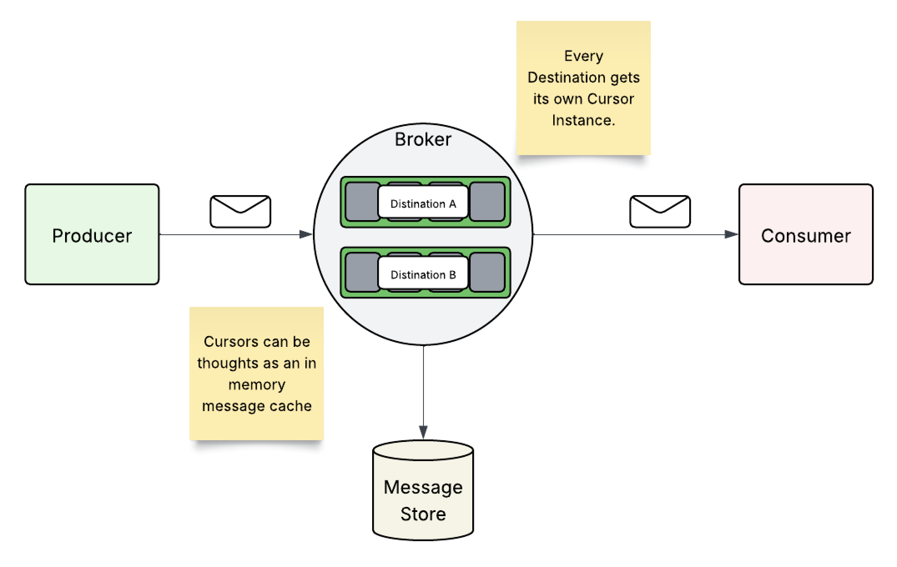
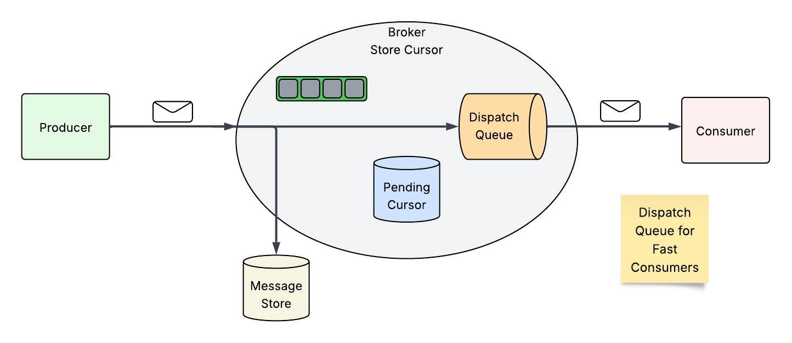
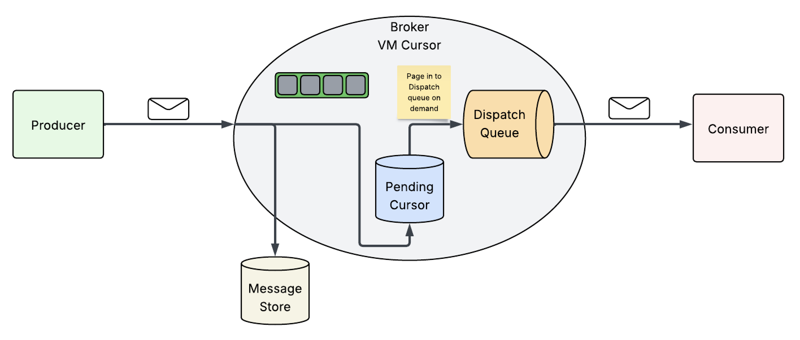

Apache ActiveMQ provides an implementation of the JMS provider.

<figure>

</figure>

Producer clients can publish messages to a destination on a broker, on
which Consumer clients can subscribe to consume those messages on said
destination.

To improve scalability ActiveMQ implements per destination strategies to
handle message consumption patterns, via "Message Cursors".

# What are Message Cursors?

Message Cursors are a mechanism to allow differing consumer patterns to
not easily exceed Broker memory.

<figure>

</figure>

Each destination on a broker has its own cursor instance, these
instances work as in-memory message reference caches.

<figure>

</figure>

These message caches feed Dispatch queues, which in turn provide
messages to the consumer client.

## Types of Message Cursors

Store-based cursors are used by default to handle persistent messages.

VM cursors are very fast, but cannot handle slow message consumers.

File-based cursors are used by default to handle non-persistent
messages. They are useful when the message store is slow and message
consumers are relatively fast.

### Store Cursor

<figure>

</figure>

<figure>

</figure>

### VM Cursor

<figure>

</figure>

### File Based Cursor

<figure>

</figure>

# Conclusion
