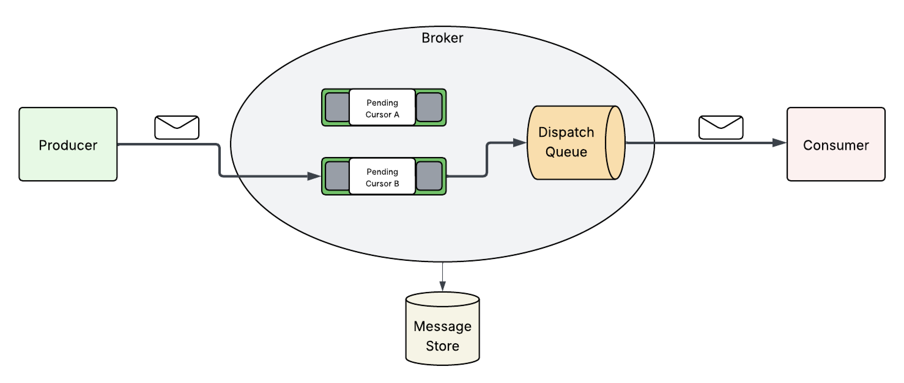
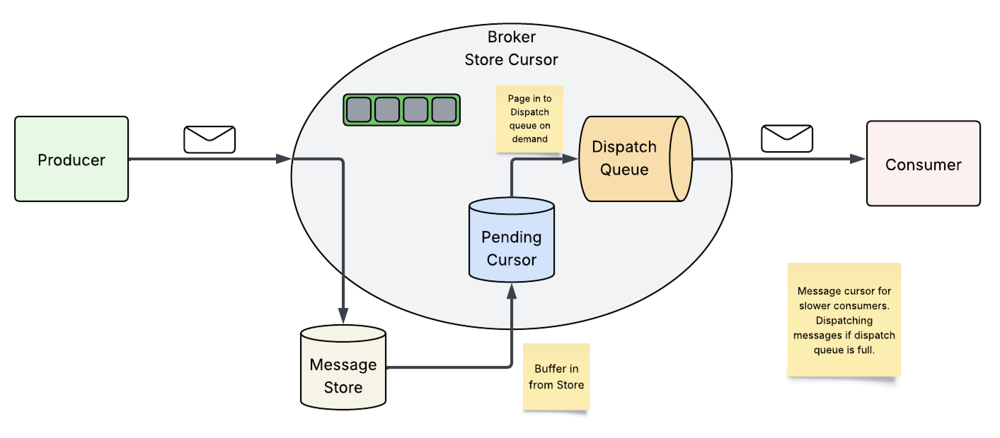

Apache ActiveMQ provides an implementation of the JMS provider.

<figure>

</figure>

Producer clients can publish messages to a destination on a broker, on
which Consumer clients can subscribe to consume those messages on said
destination.

To improve scalability ActiveMQ implements per destination strategies to
handle message consumption patterns, via "Message Cursors".

# What are Message Cursors?

Message Cursors are a mechanism to allow differing consumer patterns to
not easily exceed Broker memory.

<figure>

</figure>

Each destination on a broker has its own cursor instance, these
instances work as in-memory message reference caches.

<figure>

</figure>

These message caches feed Dispatch queues, which in turn provide
messages to the consumer client.

## Types of Message Cursors

Store-based cursors are used by default to handle persistent messages.

VM cursors are very fast, but cannot handle slow message consumers.

File-based cursors are used by default to handle non-persistent
messages. They are useful when the message store is slow and message
consumers are relatively fast.

### Store Cursor

The default strategy, broker administrators do not need to specifically
configure this behavoir. Persistent messages are saved to the message
store, non-persistent messages are passed to the pending cursor (an
embedded file based cursor handles these messages).

#### Fast Consumer

<figure>

</figure>

In the fast consumer model inbound messages are sent into the message
store and continue into the awaiting destination dispatch queue for
consumption.

#### Slow Consumer

<figure>

</figure>

In the slow consumer model inbound messages are sent into the message
store, then from the store the messages enter a pending cursor. The
destination dispatch queue pages messages from the pending cursor when
it has space for its consumers.

##### Configuration

|                              |                             |
|------------------------------|-----------------------------|
| Element                      | Description                 |
| storeCursor                  | Default strategy for Topics |
| storeDurableSubscriberCursor | Durable Subscriber          |
| storeCursor                  | Default strategy for Queues |

Topic Configuration: there is a dispatch queue and pending cursor for
every subscriber. It’s possible to configure different policies for
durable subscribers and transient subscribers

``` xml
<destinationPolicy>
      <policyMap>
        <policyEntries>
          <policyEntry topic="org.apache.>" producerFlowControl="false" memoryLimit="1mb">
            <dispatchPolicy>
              <strictOrderDispatchPolicy />
            </dispatchPolicy>
            <deadLetterStrategy>
              <individualDeadLetterStrategy  topicPrefix="Test.DLQ." />
            </deadLetterStrategy>
            <pendingSubscriberPolicy>
                <storeCursor />
            </pendingSubscriberPolicy>
            <pendingDurableSubscriberPolicy>
                <storeDurableSubscriberCursor/>
            </pendingDurableSubscriberPolicy>
          </policyEntry>
        </policyEntries>
      </policyMap>
```

Queue Configuration: there is a single dispatch Queue and pending Queue
for every destination

``` xml
<destinationPolicy>
      <policyMap>
        <policyEntries>
          <policyEntry queue="org.apache.>">
            <deadLetterStrategy>
              <individualDeadLetterStrategy queuePrefix="Test.DLQ."/>
            </deadLetterStrategy>
            <pendingQueuePolicy>
                <storeCursor />
            </pendingQueuePolicy>
          </policyEntry>
        </policyEntries>
      </policyMap>
 </destinationPolicy>
```

### VM Cursor

The VM strategy attempts to populate message references in a pending
cursor (cache), allowing the dispatch queue to page in awaiting messages
as fast as its consumers can handle.

<figure>

</figure>

This strategy should only be applied when consumers are consistently
fast. When consumers become slow or inactive for long periods of time
the broker may experience memory constraints.

#### Configuration

|                 |                                    |
|-----------------|------------------------------------|
| Element         | Description                        |
| vmCursor        | pendingSubscriberPolicy for Topics |
| vmDurableCursor |                                    |
| vmQueueCursor   |                                    |

``` xml
```

### File Based Cursor

The file based strategy employs temporary files as a paging space for
quick access to messages - this allows the pending cursor to grow to a
limit. This approach is taken instead of falling back to a slow message
store. If the message store is fast however, then this strategy should
be avoided.

<figure>

</figure>

We note that the temporary files of the file based cursor are used by
default for non-persistent messages.

#### Configuration

|                             |                                    |
|-----------------------------|------------------------------------|
| Element                     | Description                        |
| fileCursor                  | pendingSubscriberPolicy for Topics |
| fileDurableSubscriberCursor |                                    |
| fileQueueCursor             |                                    |

``` xml
```

# Conclusion

Apache ActiveMQ message cursors need careful consideration before
adjusting them outside of their default configuration. For most users
the store based strategy should be sufficient.

# About the Authors

[Jamie
Goodyear](https://github.com/savoirtech/blogs/blob/main/authors/JamieGoodyear.md)

# Reaching Out

Please do not hesitate to reach out with questions and comments, here on
the Blog, or through the Savoir Technologies website at
<https://www.savoirtech.com>.

# With Thanks

Thank you to the Apache ActiveMQ community.

\(c\) 2025 Savoir Technologies
